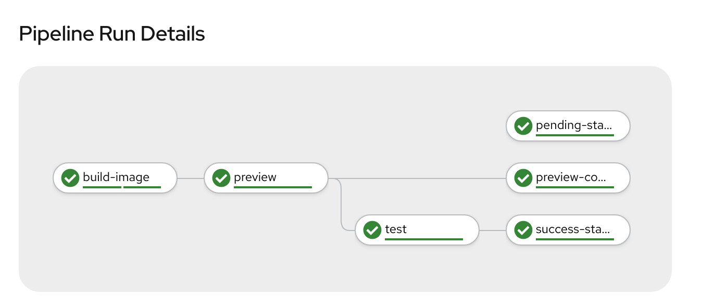

# Ike Openshift Pipelines/Tekton Demo



## Setup test app

note: ensure `ike` binary is in path

```
./workshop/content/scripts/deploy.sh
```

## Setup pipeline 

From the istio-workspace-ci-tekton-demo-lab repo:

```
make deploy-pipeline
```

* add `oc get route el-tekton-demo --template='http://{{.spec.host}}'` to repo webhook


## Setup GitHub Status update

```
oc create secret generic github --from-literal token="MY_TOKEN"
```


Open and close pull requests.
